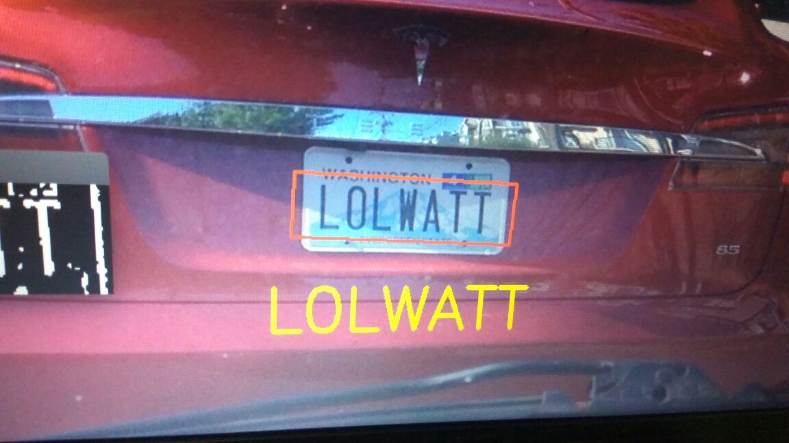
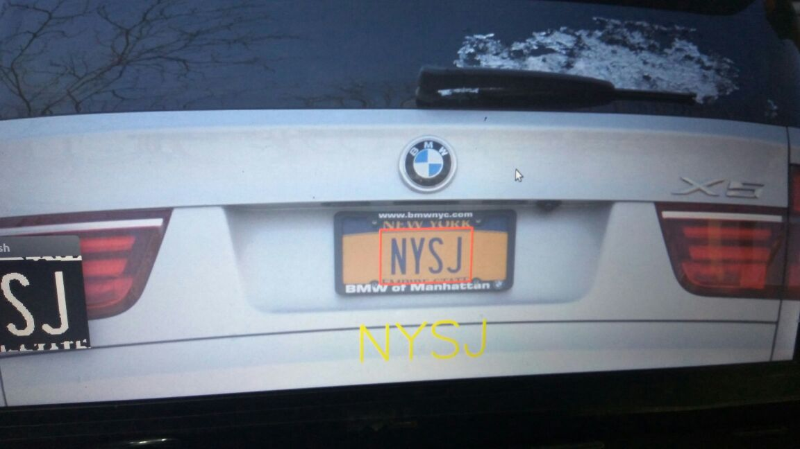
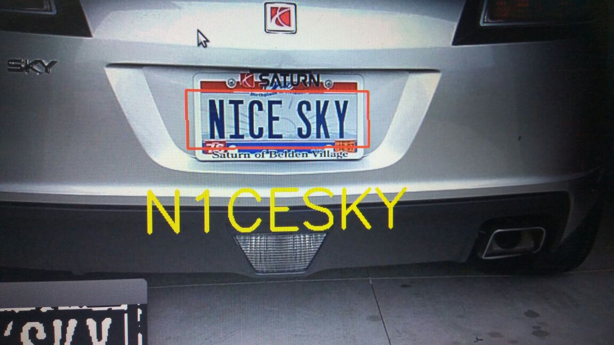
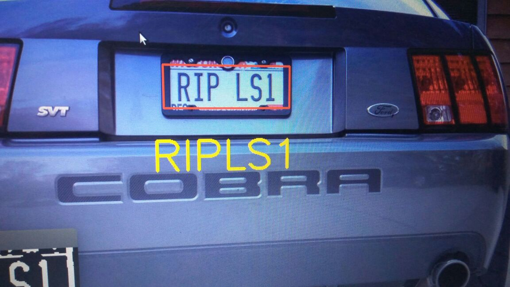

# License-Plate-Recognition
## Methodology
1. Image Preprocessing
   1. Grayscaling
   2. Blurring
   3. Thresholding
   4. Applying sobel operator for edge emphasis
2. Extract Contours
3. Validate each contours based on aspect ratio and min height and width.Remove unnecessary contours.
5. Check No of white pixels(*In majority of license plate major part of license plate has white pixels when converted to Binary.*)
4. Adjust the angles of the plates if its not in horizontal, or inclined at some angle.
5. Use Tesseract to perform OCR on the probable plates and give the license plate.
## Results

## Improvements and TO_DO
1. It fails to detect  the license plate for indian bikes because mostly they are split in two parts.

2. If there is some text bigger than the license plate
3. If image is not clear.

A better solution is to train a object detection algorithm like *YOLO* or *TensorFlowObject Dectection Framework* to train a model to identify license plate and then perform OCR on the image after performing the preprocessing.
